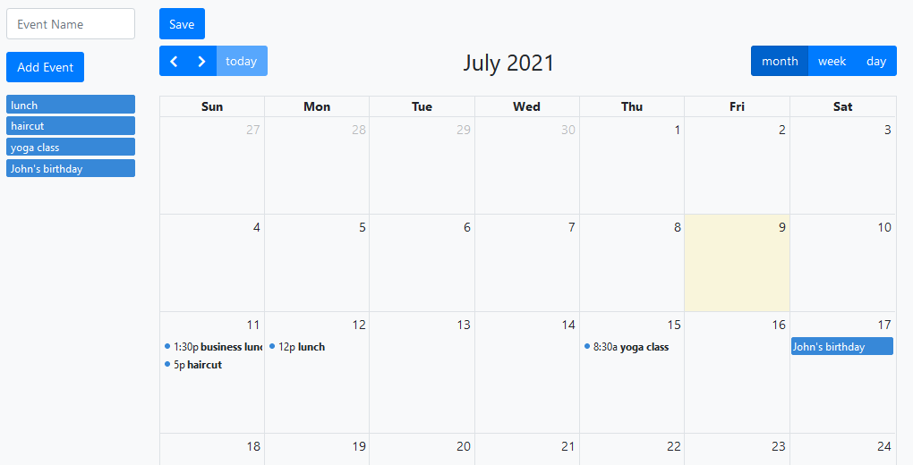

# NBU_CITB679_Calendar

This is a calendar application created using the Django Framework and fullcalendar.io frontend library.

**Technologies:** 

*Backend (versions specified in requirements.txt)*
* Django
* mysqlclient
* python-dotenv
* social-auth-app-django

*Frontend *
* Bootstrap4
* gullcalendar.io
* Ajax

---

## FNCTIONALITY

 

* User management (users have an email and a password).
* Login via GitHub (with OAuth2).
* Password reset via email.
* Calendar with 3 views (Monthly, Weekly, Daily).
* Events can be placed on the calendar, with configurable label and duration.
* To place an event, you first create a template of it on the left side, and then drag and drop it.
* Changes to the calendar are applied upon pressing the SAVE button. 

---

## INSTALLATION 

 

1) A MySQL database needs to be created (https://www.mysql.com/downloads/)

Using the command-line:

> mysql
> 
> CREATE DATABASE 'database_name';
> 
> USE 'database_name';
> 
> CREATE USER 'new_user'@'localhost' IDENTIFIED BY 'password';
> 
> GRANT ALL PRIVILEGES ON * . * TO 'new_user'@'localhost';

 

2) To use OAuth2 GitHub login, the application needs to be registered here https://github.com/settings/applications/new

 

3) A .env file needs to be created at the Django project's root (same level as manage.py), which contains the following variables:

>DB_NAME=`<name of the database to be used by Django>`

>DB_USER=`<name of the database user to be used by Django>`

>DB_PASS=`<password of the database user to be used by Django>`

>DB_HOST=`<database host to be used by Django>`

>DB_PORT=`<port to be used by Django>`

>SOCIAL_AUTH_GITHUB_KEY=`<GitHub OAuth2 key>`

>SOCIAL_AUTH_GITHUB_SECRET=`<GitHub OAuth2 secret>`

Notice: **Currently, all variables are mandatory and must be specified in the .env file (even if using fake values) or the project won't start!**

 

4) Python installation, added to PATH (recommended 3.8 or above). The project dependencies specified in the requirements.txt need to be installed using *pip* in the following way:

Windows:
> pip install -r requirements.txt

Linux:
> pip3 install -r requirements.txt (Linux)

Notice: If you encounter problems with the mysqlclient installation, visit: https://pypi.org/project/mysqlclient/

 

5) To start the server, run database migrations and run the server via the Django API script *manage.py* in the following way:

Windows:
> python manage.py migrate
> 
> python manage.py runserver

Linux:
> python3 manage.py migrate
> 
> python3 manage.py runserver

 

6) In order to inspect the functionality for resetting account password via email, a specific SMTPD server must be started, which will not send emails, but will instead discard them in the command-line. To create this server, open a new terminal session and run the following command:

*Windows*:
> python -m smtpd -n -c DebuggingServer localhost:1025

*Linux*:
> python3 -m smtpd -n -c DebuggingServer localhost:1025